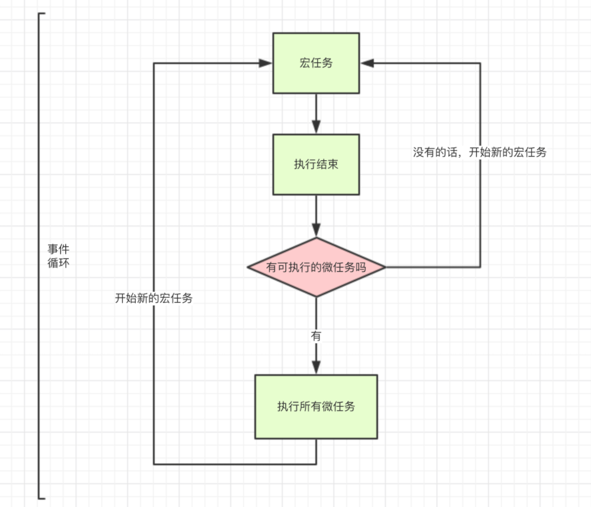

# 远景智能——前端暑期实习一面

> 岗位：前端开发实习生-上海岗位
>
> 面试时间：2021-03-31 16 : 00
>
> 面试形式：电话面试
>
> 面试时长：约 75 分钟

投了也有段时间了，之前做了英语测评跟性格测试，还以为会没有面试机会了呢。

没有提前通知面试时间，面试官三点半的时候打电话来问我是否方便，当时不太方便所以约了四点。

## 面试感受：

面试官很准时，四点打来了电话。

感觉面试官非常不错，开始的时候是聊了聊我以前实习的项目，项目都跟前端没有关系。说了大概十几二十分钟吧，说起来我都有点忘记我的项目当时都是怎么做的了，很多细节自己都描述不太清楚了。后面慢慢问了我一些基础的知识，不会很难，也会在面试过程中引导我。

没想到最后竟然面了一个小时十六分钟，我还是第一次经历这么长时间的面试，又是一次进步😂。

下面是面试的一些问题，可能有所遗漏，并且有些描述不是很清楚，还望理解。

## 面试复盘：

1. 聊自己的**实习经历**、**项目**

   > From：**TianTianUp**
   >
   > 我觉得项目相关的话题，是个挺难的话题，围绕它展开的话，可以延伸出很多话题，我列举了些有意思的:
   >
   > - 项目难点。（如何发现问题，解决思路，最后结果）
   > - 项目考虑过优化吗，你是如何优化的，思路是什么。
   > - 项目的组织架构，你对它的现有架构的理解，哪些优点值得借鉴，哪些缺点需要改进。
   > - 如果让你从0到1建一个项目，你考虑的点是什么，有哪些流程需要注意的。
   > - 项目中代码规范，你们项目有方案吗，你了解的代码规范有哪些方案。
   > - 说一说项目中你们是如何测试的，有哪些单元测试方案，能不能说一说。
   > - 项目中引入TS的原因，为什么这么做。
   >
   > 不过对于**应届生**来说，问项目都是围绕你简历来问的，比如我当时的项目，我觉得没有好的难点，我就**着重说明**了下，我对项目是如何优化的，优化了哪些点。
   >
   > 整个面试下来，都会问，你项目写到的优化的地方，能不能具体聊一聊。
   >
   > 这个时候，真的要把握机会了，问到你会的点，你得有清晰的思路，可以参考STAR法则。
   >
   > 重新回顾一下 STAR 法则四要素：
   >
   > - **Situation**：事情是在什么情况下发生，基于一个怎样的背景；
   > - **Task**：你是如何明确你的任务的；
   > - **Action**：针对这样的情况分析，你采用了什么行动方式，具体做了哪些工作内容；
   > - **Result**：结果怎样，带来了什么价值，在整个过程中你学到了什么，有什么新的体会。
   >
   > 这里有段话，我觉得说的很不错:
   >
   > > 往往大部分同学一上来就直接介绍做了什么以及实现的过程，条理也比较清晰，内容也颇具技术含量。但很多同学很容易忽略了 Situation 和 Result 的部分也就是背景和结果。或者是在面试官进一步了解追问细节的时候容易惊慌失措。这些原因往往都是由于面试前对自己的经历没有将来龙去脉讲清楚以及总结不够全面和深入。
   >
   > 基本上，我对项目这块目前能聊的就是这么多，对了，如果你面**大厂核心部门**，可能还需要关注的点是，**项目的组织架构理解**，让你实现一个项目，整个流程需要注意考虑哪些点。
   >
   > 这块真的可以着重准备一下，以我这次春招经验来谈，是重点。

   

2. **行内元素、块级元素**

   什么叫**行内元素**？

   常见的`span、a、lable、strong、b`等html标签都是行内元素

   `a, span, label, strong, em, br, img, input, select, textarea, cite`

   什么叫**块级元素**？

   常见的`div、p、li、h1、h2、h3、h4`等html标签都是块级元素

   `div, h1~h6, p, form, ul, li, ol, dl, address, hr, menu, table, fieldset`

   

   在标准文档流里面，

   **块级元素**具有以下特点：

   ```
   ① 总是在新行上开始，占据一整行；
   ② 高度，行高以及外边距和内边距都可控制；
   ③ 宽带始终是与浏览器宽度一样，与内容无关； 
   ④ 它可以容纳内联元素和其他块元素。
   ```

   **行内元素**的特点：

   ```
   ① 和其他元素都在一行上；
   ② 高，行高及外边距和内边距部分可改变；
   ③ 宽度只与内容有关；
   ④ 行内元素只能容纳文本或者其他行内元素。
   不可以设置宽高，其宽度随着内容增加，高度随字体大小而改变，内联元素可以设置外边界，但是外边界不对上下起作用，只能对左右起作用，也可以设置内边界，但是内边界在ie6中不对上下起作用，只能对左右起作用
   ```

   **可变元素**

   可变元素为根据上下文语境决定该元素为块元素或者行内元素。

   - applet - java applet

   - button - 按钮

   - del - 删除文本

   - iframe - inline frame

   - ins - 插入的文本

   - map - 图片区块(map)

   - object - object对象

   - script - 客户端脚本

     

   **CSS设置行内元素的**

   - 水平居中

     ```
         div{text-align:center} /*DIV内的行内元素均会水平居中*/ 
     ```

   - 垂直居中

     ```
         div{height:30px; line-height:30px} /*DIV内的行内元素均会垂直居中*/ 
     ```

   **CSS设置块级元素的**

   - 水平居中
     `div p{margin:0 auto; width:500px} /*块级元素p一定要设置宽度， 才能相当于DIV父容器水平居中*/`
   - 垂直居中
     `div{width:500px} /*DIV父容器设置宽度*/ div p{margin:0 aut0; height:30px; line-height:30px} /*块级元素p也可以加个宽度， 以达到相对于DIV父容器的水平居中效果*/`

   

3. 常用 CSS、HTML 标签、语义化标签

   **article**定义文章、**footer**定义页脚、**header**定义页眉、**nav**定义导航、**section**文档中的区段、aside定义侧栏。

   **input**新增 type属性：email（输入为邮件格式）、tel（电话格式）、url（url格式）、search（搜索框）、range（自由拖动滑块）。

   新增多媒体标签：**video**，**audio**

   

4. 原生浏览器事件，**事件委托**，冒泡，捕获

   **核心事件：**

   （1）表单事件：focus（获取焦点）、blur（失去焦点）、submit、change（域的内容被改变）。

   （2）鼠标事件：mouseover（鼠标在某元素之上）、mousedown（鼠标按下）、mousemove（鼠标移动）、mouseout（鼠标从某元素移开）、click、dblclick、onselect（元素被选中）。

   （3）键盘事件：keydown（按下）、keyup、keypress（按下后松开）。

   （4）触屏：touchstart、touchmove、touchend。

   （5）拖放：dragstart、dragenter、dragend。

   （6）文档加载：load、DOMContentLoaded。

   常见的事件：浏览器事件 / 鼠标事件 / 键盘事件 / 表单事件 / 触摸事件。

   

   （1）**元素.addEventListener**('事件类型'，事件处理函数，冒泡false、捕获true) 非IE78以下。

   （2）**元素.attachEvent**('on+事件类型'，事件处理函数) IE78以下。

   **addEventListener**除了可以设置元素触发顺序外，还能多次绑定事件，从上到下依次执行，而on 事件多次绑定的话会出现覆盖。

   addEventListener中的this是**当前绑定事件的对象**，attachEvent中的this是window。

   事件的传播（事件流，指事件的流向，事件的执行顺序）。

   W3C中事件经历三个阶段：**捕获阶段(1 capturing)、目标阶段(2 targeting)、冒泡阶段(3 bubbling)**。

   **阻止事件传播**：**e.stopPropagation()**（非IE），**e.cancelBubble=true**（IE）。

   阻止默认事件：e.preventDefault()（非IE），e.returnValue = false（IE）。**focus、blur、scroll不支持冒泡。**

   **冒泡事件**：是**指子元素向父元素传递的过程。**

   **捕获事件**：是指父元素向子元素传递的过程。

   **事件委托**（把要做的事情委托给别人来做）：因为冒泡机制，触发子元素事件的时候，会同步触发父元素的相同事件 ，所以就可以把子元素的事件委托给父元素来做。

   事件委托**优点**：（1）减少事件注册；（2）避免内存泄漏。（3）后面添加的元素也会有事件。

   

5. **自定义事件**用过吗？

   目前实现**自定义事件**的两种主要方式是 JS 原生的 `Event()` 构造函数和 `CustomEvent()` 构造函数来创建。

   ## **1. Event()**

   `Event()` 构造函数, 创建一个新的事件对象 `Event`。

   ### **1.1 语法**

   ```text
   let myEvent = new Event(typeArg, eventInit);
   ```

   ### **1.2 参数**

   `typeArg` ： `DOMString` 类型，表示创建事件的名称；
   `eventInit` ：可选配置项，包括：

   **字段名称说明是否可选类型默认值**`bubbles`表示该事件**是否冒泡**。可选`Boolean`false`cancelable`表示该事件**能否被取消**。可选`Boolean`false`composed`指示事件是否会在**影子DOM根节点之外**触发侦听器。可选`Boolean`false

   ### **1.3 演示示例**

   ```text
   // 创建一个支持冒泡且不能被取消的 pingan 事件
   let myEvent = new Event("pingan", {"bubbles":true, "cancelable":false});
   document.dispatchEvent(myEvent);
   
   // 事件可以在任何元素触发，不仅仅是document
   testDOM.dispatchEvent(myEvent);
   ```

   ## **2. CustomEvent()**

   `CustomEvent()` 构造函数, 创建一个新的事件对象 `CustomEvent`。

   ### **2.1 语法**

   ```text
   let myEvent = new CustomEvent(typeArg, eventInit);
   ```

   ### **2.2 参数**

   `typeArg` ： `DOMString` 类型，表示创建事件的名称；
   `eventInit` ：可选配置项，包括：

   **字段名称说明是否可选类型默认值**`detail`表示该事件中需要被传递的数据，在 `EventListener` 获取。可选`Any`null`bubbles`表示该事件**是否冒泡**。可选`Boolean`false`cancelable`表示该事件**能否被取消**。可选`Boolean`false

   ### **2.3 演示示例**

   ```、
   // 创建事件
   let myEvent = new CustomEvent("pingan", {
   	detail: { name: "wangpingan" }
   });
   
   // 添加适当的事件监听器
   window.addEventListener("pingan", e => {
   	alert(`pingan事件触发，是 ${e.detail.name} 触发。`);
   });
   document.getElementById("leo2").addEventListener(
     "click", function () {
       // 派发事件
   		window.dispatchEvent(pingan2Event);
     }
   )
   ```

   ## **3. Event() 与 CustomEvent() 区别**

   从两者支持的参数中，可以看出：
   `Event()` 适合创建简单的自定义事件，而 `CustomEvent()` 支持参数传递的自定义事件，它支持 `detail` 参数，作为事件中**需要被传递的数据**，并在 `EventListener` 获取。

   **注意:**
   当一个事件触发时，若相应的元素及其上级元素没有进行事件监听，则不会有回调操作执行。
   当需要对于子元素进行监听，可以在其父元素进行事件托管，让事件在事件冒泡阶段被监听器捕获并执行。此时可以使用 `event.target` 获取到具体触发事件的元素。

   

6. 使用 `<a>` 做按钮，如何取消 `<a>` 标签默认跳转行为

   方法一：

   `<a href="javascript:;">aaa</a>`

   方法二：

   `<a href = " # ">百度</a>`

   方法三：

    e.preventDefault();阻止默认事件(不支持IE)

   

7. 实现一个可以拖动的盒子要注意些什么？我回答需要注意 **节流**

   还是得自己去实现一下

   

8. **跨域**概念，解决方案，**JSONP** 一些原理

   > 前端常见跨域解决方案（全）
   >
   > https://segmentfault.com/a/1190000011145364

   **什么是同源策略？**
   同源策略/SOP（Same origin policy）是一种约定，由Netscape公司1995年引入浏览器，它是浏览器最核心也最基本的安全功能，如果缺少了同源策略，浏览器很容易受到XSS、CSFR等攻击。所谓同源是指"协议+域名+端口"三者相同，即便两个不同的域名指向同一个ip地址，也非同源。

   同源策略限制以下几种行为：

   ```
   1.) Cookie、LocalStorage 和 IndexDB 无法读取
   2.) DOM 和 Js对象无法获得
   3.) AJAX 请求不能发送
   ```

   ### **常见跨域场景**

   ```
   URL                                      说明                    是否允许通信
   http://www.domain.com/a.js
   http://www.domain.com/b.js         同一域名，不同文件或路径           允许
   http://www.domain.com/lab/c.js
   
   http://www.domain.com:8000/a.js
   http://www.domain.com/b.js         同一域名，不同端口                不允许
    
   http://www.domain.com/a.js
   https://www.domain.com/b.js        同一域名，不同协议                不允许
    
   http://www.domain.com/a.js
   http://192.168.4.12/b.js           域名和域名对应相同ip              不允许
    
   http://www.domain.com/a.js
   http://x.domain.com/b.js           主域相同，子域不同                不允许
   http://domain.com/c.js
    
   http://www.domain1.com/a.js
   http://www.domain2.com/b.js        不同域名                         不允许
   ```

   ### **跨域解决方案**

   1、 通过**jsonp**跨域
   2、 document.domain + iframe跨域
   3、 location.hash + iframe
   4、 window.name + iframe跨域
   5、 **postMessage跨域**
   6、 **跨域资源共享（CORS**）
   7、 **nginx代理跨域**
   8、 nodejs中间件代理跨域
   9、 **WebSocket协议跨域**

   #### **一、 通过jsonp跨域**

   通常为了减轻web服务器的负载，我们把js、css，img等静态资源分离到另一台独立域名的服务器上，在html页面中再通过相应的标签从不同域名下加载静态资源，而被浏览器允许，基于此原理，我们可以通过动态创建script，再请求一个带参网址实现跨域通信。

   1.）原生实现：

   ```
    <script>
       var script = document.createElement('script');
       script.type = 'text/javascript';
   
       // 传参一个回调函数名给后端，方便后端返回时执行这个在前端定义的回调函数
       script.src = 'http://www.domain2.com:8080/login?user=admin&callback=handleCallback';
       document.head.appendChild(script);
   
       // 回调执行函数
       function handleCallback(res) {
           alert(JSON.stringify(res));
       }
    </script>
   ```

   服务端返回如下（返回时即执行全局函数）：

   ```
   handleCallback({"status": true, "user": "admin"})
   ```

   **jsonp缺点：只能实现get一种请求。**

   

   #### **跨域资源共享（CORS）**

   普通跨域请求：只服务端设置Access-Control-Allow-Origin即可，前端无须设置，若要带cookie请求：前后端都需要设置。

   需注意的是：由于同源策略的限制，**所读取的cookie为跨域请求接口所在域的cookie，而非当前页**。

   如果想实现当前页cookie的写入，可参考下文：七、**nginx反向代理中设置proxy_cookie_domain** 和 八、**NodeJs中间件代理中cookieDomainRewrite参数的设置。**

   目前，所有浏览器都支持该功能(IE8+：IE8/9需要使用XDomainRequest对象来支持CORS）)，CORS也已经成为主流的跨域解决方案。

   

9. **cookie **原理、应用，服务端怎么识别到 cookie 的？

   Web缓存大致可以分为:数据库缓存、服务器端缓存(代理服务器缓存、CDN 缓存)、浏览器缓存。 **浏览器缓存**: HTTP缓存、indexDB、**cookie**、localstorage、manifest、userData等等。

   

   HTTP缓存分类：**强缓存和协商缓存**（http缓存能帮助服务器提高并发性能，很多资源不需要重复请求，可直接从浏览器中拿缓存。）

   （1）浏览器在加载资源时，先根据这个资源的http头信息判断是否命中强缓存，如果命中则加载缓存中的资源，不会发请求到服务器。

   （2）如果未命中强缓存，则浏览器会将资源加载请求发送到服务器。服务器判断浏览器本地缓存是否失效。若可以使用，浏览器继续从缓存中加载资源。

   （3）如果未命中协商缓存，则服务器会将完整的资源返回给浏览器，浏览器加载资源，并更新缓存。

   **协商个什么？**浏览器问服务器我缓存的文件有没有更新，若没有更新，返回304表示浏览器可以使用缓存。若文件更新了，返回200表示浏览器不能使用缓存。

   

   简单谈一下cookie？

   可用document.cookie = ‘ ’来修改，相同会覆盖，不相同会追加。前端可操作，后端也可操作。

   document.cookie = ‘ 键=值；expires=’ 过期时间

   document.cookie = ‘username=zs ’

   document.cookie = ‘age=18’

   获取console.log(document.cookie )//取出来的是一个字符串形式，username=zs；age=18，然后需要用split拆分处理字符串，获取username，age

   当用户访问网站的时候，会发起大量的请求，大部分是基于HTTP协议的HTTP请求，**而HTTP协议是无状态的（每个请求都是独立的，前后没有联系），阻碍了交互web的实现。**

   举个例子：一般网站后台访问会让你登录验证，验证通过够就可以随意访问各个页面，但如果每访问一个页面就需要验证一次，这种体验就会很差。**cookie可以让浏览器在服务器之间传递额外的数据**。

   **一般用来处理登录等场景**，目的是让服务端知道谁发出的这次请求。如果你请求了接口进行登录，**服务端验证通过后会在响应头加入Set-Cookie字段**，然后下次再发请求的时候，浏览器会自动将cookie附加在HTTP请求头Cookie中，服务端就能知道这个用户已经登录过了。**服务端可以设置httpOnly，使得前端无法操作cookie。**

   **cookie是服务器提供的一种用于维护会话状态信息的数据**。通过服务器发送到浏览器，浏览器保存在本地，**当下一次有同源的请求时，将保存的cookie值添加到请求头部，发送给服务端**。这可用来实现记录用户登录状态等功能。**cookie一般可以存储4k大小的数据，并且只能够被同源的网页所共享访问。**

   服务端可使用Set-Cookie在响应头部来配置cookie信息。一条cookie包括**5个属性值**：

   **expires**：cookie失效的时间。

   **domain**：域名。

   **path**：路径（domain和path一起限制了cookie能够被哪些url访问）。

   **secure**：保证在https的加密通信中传输以防截获。

   **HttpOnly**：规定了这个cookie只能被服务器访问，js脚本不能操作。

   在发生xhr的跨域请求的时候，即使是同源下的cookie，也不会被自动添加到请求头部，除非显示地规定设置xhr.withCredentials=true。

   cookie过去用来存储用户登录状态，现在都是用localStorage通过存token来操作。

   缺点：

   （1）Cookie可以将登陆的用户名和密码等存储到cookie中，下次登陆可省去重新输入，简化了流程。但每个HTTP请求头都带上cookie信息，增加请求数据量。

   （1）不安全，容易被劫持，不适合存储敏感数据。

   （2）Cookie最多存储4kb的信息，不能应对复杂存储需求，如缓存表单信息、数据同步等。

   （3）默认浏览器关闭cookie就过期了，但**可设置过期时间。**

   

   **session和cookies**

   session和cookies**区别**：HTTP是无状态协议，服务器单从网络连接无法知道客户身份。而cookie和session就是用来跟踪浏览器用户身份的，cookie数据保存在客户端，session数据保存在服务器端。

   session和cookies的**关系**：服务端设置session，服务端返回给客户端的信息在响应头中，并且带着set-cookie=’connect.sid’，随之客户端把信息放在本地cookie的HttpOnly中，客户端再次向服务端发送请求的时候，在请求头中，cookies会默认把connect.sid传递给服务器。

   cookies浏览器、不安全，session服务端、安全、占用服务器资源，可以将登录信息等重要信息放在session中，其他需要保留的信息可放在cookie中。

   

10. 浏览器存储， **localStroage**，**sessionStroage**

    本地存储**localStorage**：20M，**可多窗口（页面）共享**，**永远不会过期，即使浏览器关闭**，还会存在。**同源（协议，域名和端口相同）的本地存储可以共享**。明文存储，不安全。

    会话存储**sessionStorage**：5M，在同一个窗口(页面)下数据可以共享，只能应用于会话期间，**当关闭页面或浏览器，会话中的数据就会被自动清除。**

    **localStorage，sessionStorage只能存储字符串，可以将对象JSON.stringify()编码后存储。**

    API：localstorage.setItem(key, value)，localstorage.getItem(key)，removeItem(key) 删除键值为key的存储内容，clear() 清空所有存储内容

    

    Cookies、Localstorage和Sessionstorage可通过js脚本修改，存储在服务端的session无法修改，适合存储用户敏感信息。

    

11. **Vue 路由**两种方式如何实现的？

    > **参考链接：**
    >
    > https://blog.csdn.net/Charissa2017/article/details/104779412
    >

    **hash模式**

    使用**window.location.hash属性及窗口的onhashchange事件**，可以实现监听浏览器地址hash值变化，执行相应的js切换网页。下面具体介绍几个使用过程中必须理解的要点：

    - hash指的是地址中#号以及后面的字符，也称为散列值。hash也称作锚点，本身是用来做页面跳转定位的。如http://localhost/index.html#abc，这里的#abc就是hash；
    - 散列值是不会随请求发送到服务器端的，所以改变hash，不会重新加载页面；
    - 监听 window 的 hashchange 事件，当散列值改变时，可以通过 location.hash 来获取和设置hash值；
    - location.hash值的变化会直接反应到浏览器地址栏；

    **history模式**

    - window.history 属性指向 History 对象，它表示当前窗口的浏览历史。当发生改变时，只会改变页面的路径，不会刷新页面。

    - History 对象保存了当前窗口访问过的所有页面网址。通过 history.length 可以得出当前窗口一共访问过几个网址。

    - 由于安全原因，浏览器不允许脚本读取这些地址，但是允许在地址之间导航。

    - 浏览器工具栏的“前进”和“后退”按钮，其实就是对 History 对象进行操作。

    

    路由需要实现三个功能：

    当浏览器地址变化时，切换页面；

    点击浏览器【后退】、【前进】按钮，网页内容跟随变化；

    刷新浏览器，网页加载当前路由对应内容；

    在单页面web网页中, 单纯的浏览器地址改变, 网页不会重载，如单纯的hash网址改变网页不会变化，因此我们的路由主要是通过监听事件，并利用js实现动态改变网页内容，有两种实现方式：

    **hash模式**：监听浏览器地址hash值变化，执行相应的js切换网页；
    **history模式**：利用**history API**实现url地址改变，网页内容改变；
    它们的**区别**最明显的就是hash会在浏览器地址后面增加#号，而history可以自定义地址。

    

    **hash模式：**在浏览器中符号“#”，#以及#后面的字符称之为hash，用**window.location.hash**读取；
    特点：hash虽然在URL中，但不被包括在HTTP请求中；用来指导浏览器动作，对服务端安全无用，hash不会重加载页面。
    hash 模式下，仅 hash 符号之前的内容会被包含在请求中，如 [http://www.xxx.com](http://www.xxx.com/)，因此对于后端来说，即使没有做到对路由的全覆盖，也不会返回 404 错误。

    **history模式：**history采用**HTML5的新特性**；且提供了两个新方法：pushState（），replaceState（）可以对浏览器历史记录栈进行修改，以及popState事件的监听到状态变更。
    history 模式下，前端的 URL 必须和实际向后端发起请求的 URL 一致，如 http://www.xxx.com/items/id。后端如果缺少对 /items/id 的路由处理，将返回 404 错误。

    **Vue-Router 官网里如此描述：**“不过这种模式要玩好，还需要后台配置支持……所以呢，你要在服务端增加一个覆盖所有情况的候选资源：如果 URL 匹配不到任何静态资源，则应该返回同一个 index.html 页面，这个页面就是你 app 依赖的页面。”

    

12. JS **数据类型**，**undefined 跟 null** 的区别，**Symbol** 的特点

    首先 Undefined 和 Null 都是基本数据类型，这两个基本数据类型分别都只有一个值，就是 undefined 和 null。
    **undefined 代表的含义是未定义，**
    **null 代表的含义是空对象**。

    一般变量声明了但还没有定义的时候会返回 undefined，null主要用于赋值给一些可能会返回对象的变量，作为初始化。

    当我们使用**双等号对两种类型的值进行比较时会返回 true，使用三个等号时会返回 false**。

    声明的变量还未初始化时，默认为undefined。调用函数时，如果没提供应提供的参数，该参数就等于undefined。**当函数没有返回值时，默认返回undefined**。未定义的变量是在程序中声明但未给出任何值得变量。如果尝试读取未定义变量的值，则返回为定义的值。

    

    当检测 `null` 或 `undefined` 时，注意[相等（==）与全等（===）两个操作符的区别](https://developer.mozilla.org/en-US/docs/Web/JavaScript/Reference/Operators/Comparison_Operators) ，前者会执行类型转换：

    ```javascript
    null === undefined // false
    null  == undefined // true
    null === null // true
    null == null // true
    typeof null        // "object" (因为一些以前的原因而不是'null')
    typeof undefined   // "undefined"
    !null //true
    isNaN(1 + null) // false
    isNaN(1 + undefined) // true
    ```

    

    symbol是基本数据类型（es6的新数据类型），定义对象的唯一属性名。Symbol()函数会返回symbol类型的值，该类型具有静态属性和静态方法。但作为构造函数来说它并不完整，因为不支持语法："new Symbol()"。

    Symbol值作为属性名时，该属性是公有属性，可以在类的外部访问。但是不会出现在for...in、for...of的循环中，也不会被Object.keys()、 Object.getOwnPropertyNames()返回。如果要读取到一个对象的Symbol属性，可以通过 Object.getOwnPropertySymbols()和Reflect.ownKeys()取到。

    

13. **==** 跟 **===** 的一些知识

    **标准相等操作符**(`==` and `!=`) 使用 [Abstract Equality Comparison Algorithm](http://www.ecma-international.org/ecma-262/5.1/#sec-11.9.3) 去比较两个操作数。当两个操作数类型不相等时，会在比较前尝试将其转换为相同类型。 e.g., 对于表达式 `5 == '5'`, 在比较前会先将右边字符串类型的操作数 5 转换为数字。

    **严格相等操作符** (`===` and `!==`) 使用 Strict Equality Comparison Algorithm 并尝试对两个相同操作数进行相等比较，如果它们的类型不相等，那么永远会返回false 所以 `5 !== '5'。`

    当需要明确操作数的类型和值的时候，或者操作数的确切类型非常重要时，应使用严格相等操作符。否则，当你允许操作数在比较前进行类型转换时，可以使用标准相等操作符来比较。

    当比较运算涉及类型转换时 (i.e., non–strict comparison), JavaScript 会按以下规则对字符串，数字，布尔或对象类型的操作数进行操作:

    - **当比较数字和字符串时，字符串会转换成数字值**。 JavaScript 尝试将数字字面量转换为数字类型的值。 首先, 一个数学上的值会从数字字面量中衍生出来，然后这个值将被转为一个最接近的`Number`类型的值。
    - 如果其中一个操作数为**布尔类型**，那么布尔操作数如果为true，那么会转换为**1**，如果为false，会转换为整数**0**，即0。
    - 如果**一个对象与数字或字符串相比较**，JavaScript会尝试**返回对象的默认值**。操作符会尝试通过方法valueOf和toString将对象转换为其原始值（一个字符串或数字类型的值）。如果尝试转换失败，会产生一个运行时错误。
    - 注意：**当且仅当与原始值比较时，对象会被转换为原始值**。当两个操作数均为对象时，它们作为对象进行比较，仅当它们引用相同对象时返回true。

    **注意:** 字符串对象的类型是对象，不是字符串！字符串对象很少被使用，所以下面的结果也许会让你惊讶：

    ```javascript
    // true as both operands are Type String (i.e. string primitives):
    'foo' === 'foo'
    
    var a = new String('foo');
    var b = new String('foo');
    
    // false as a and b are Type Object and reference different objects
    a == b
    
    // false as a and b are Type Object and reference different objects
    a === b
    
    // true as a and 'foo' are of different type and, the Object (a)
    // is converted to String 'foo' before comparison
    a == 'foo' 
    ```

14. **for...of** 循环是怎么实现的？

    **`for...of`语句**在[可迭代对象](https://developer.mozilla.org/zh-CN/docs/Web/JavaScript/Reference/Iteration_protocols)（包括 [`Array`](https://developer.mozilla.org/zh-CN/docs/Web/JavaScript/Reference/Global_Objects/Array)，[`Map`](https://developer.mozilla.org/zh-CN/docs/Web/JavaScript/Reference/Global_Objects/Map)，[`Set`](https://developer.mozilla.org/zh-CN/docs/Web/JavaScript/Reference/Global_Objects/Set)，[`String`](https://developer.mozilla.org/zh-CN/docs/Web/JavaScript/Reference/Global_Objects/String)，[`TypedArray`](https://developer.mozilla.org/zh-CN/docs/Web/JavaScript/Reference/Global_Objects/TypedArray)，[arguments](https://developer.mozilla.org/en-US/docs/Web/JavaScript/Reference/Functions_and_function_scope/arguments) 对象等等）上创建一个迭代循环，调用自定义迭代钩子，并为每个不同属性的值执行语句

    ## [语法](https://developer.mozilla.org/zh-CN/docs/Web/JavaScript/Reference/Statements/for...of#语法)

    ```
    for (variable of iterable) {
        //statements
    }
    ```

    - `variable`

      在每次迭代中，将不同属性的值分配给变量。

    - `iterable`

      被迭代枚举其属性的对象。

    无论是`for...in`还是`for...of`语句都是迭代一些东西。它们之间的主要区别在于它们的迭代方式。

    [`for...in`](https://developer.mozilla.org/zh-CN/docs/Web/JavaScript/Reference/Statements/for...in) 语句以任意顺序迭代对象的[可枚举属性](https://developer.mozilla.org/zh-CN/docs/Web/JavaScript/Enumerability_and_ownership_of_properties)。

    `for...of` 语句遍历[可迭代对象](https://developer.mozilla.org/zh-CN/docs/Web/JavaScript/Guide/Iterators_and_Generators#iterables)定义要迭代的数据。

    

15. JS **事件循环**，如何实现异步的？具体说说。**宏任务，微任务**，如何解释传给定时器的方法 **this** 丢失的问题？

    需要再多理解理解事件循环的相关内容

    

    导图要表达的内容用文字来表述的话：

    - 同步和异步任务分别进入不同的执行"场所"，同步的进入主线程，异步的进入Event Table并注册函数。
    - 当指定的事情完成时，Event Table会将这个函数移入Event Queue。
    - 主线程内的任务执行完毕为空，会去Event Queue读取对应的函数，进入主线程执行。
    - 上述过程会不断重复，也就是常说的Event Loop(事件循环)。

    事件循环，宏任务，微任务的关系如图所示：

    

    

16. **bind，call，apply**

    # 怎么改变 this 的指向

    改变 this 的指向我总结有以下几种方法：

    - 使用 ES6 的箭头函数
    - 在函数内部使用 `_this = this`
    - 使用 `apply`、`call`、`bind`
    - new 实例化一个对象

    例 7：

    ```
        var name = "windowsName";
    
        var a = {
            name : "Cherry",
    
            func1: function () {
                console.log(this.name)     
            },
    
            func2: function () {
                setTimeout(  function () {
                    this.func1()
                },100);
            }
    
        };
    
        a.func2()     // this.func1 is not a function复制代码
    ```

    在不使用箭头函数的情况下，是会报错的，因为最后调用 `setTimeout` 的对象是 window，但是在 window 中并没有 func1 函数。

    我们在改变 this 指向这一节将把这个例子作为 demo 进行改造.

    # apply、call、bind 区别

    刚刚我们已经介绍了 apply、call、bind 都是可以改变 this 的指向的，但是这三个函数稍有不同。

    在 [MDN](https://developer.mozilla.org/zh-CN/docs/Web/JavaScript/Reference/Global_Objects/Function/apply) 中定义 apply 如下；

    > apply() 方法调用一个函数, 其具有一个指定的this值，以及作为一个数组（或类似数组的对象）提供的参数

    语法：

    > fun.apply(thisArg, [argsArray])

    - thisArg：在 fun 函数运行时指定的 this 值。需要注意的是，指定的 this 值并不一定是该函数执行时真正的 this 值，如果这个函数处于非严格模式下，则指定为 null 或 undefined 时会自动指向全局对象（浏览器中就是window对象），同时值为原始值（数字，字符串，布尔值）的 this 会指向该原始值的自动包装对象。
    - argsArray：一个数组或者类数组对象，其中的数组元素将作为单独的参数传给 fun 函数。如果该参数的值为null 或 undefined，则表示不需要传入任何参数。从ECMAScript 5 开始可以使用类数组对象。浏览器兼容性请参阅本文底部内容。

    ## apply 和 call 的区别

    其实 apply 和 call 基本类似，他们的区别只是传入的参数不同。

    call 的语法为：

    ```
    fun.call(thisArg[, arg1[, arg2[, ...]]])复制代码
    ```

    所以 apply 和 call 的区别是 call 方法接受的是若干个参数列表，而 apply 接收的是一个包含多个参数的数组。

    ## bind 和 apply、call 区别

    我们先来将刚刚的例子使用 bind 试一下

    ```
        var a ={
            name : "Cherry",
            fn : function (a,b) {
                console.log( a + b)
            }
        }
    
        var b = a.fn;
        b.bind(a,1,2)复制代码
    ```

    我们会发现并没有输出，这是为什么呢，我们来看一下 [MDN](https://developer.mozilla.org/zh-CN/docs/Web/JavaScript/Reference/Global_Objects/Function/bind) 上的文档说明：

    > bind()方法创建一个新的函数, 当被调用时，将其this关键字设置为提供的值，在调用新函数时，在任何提供之前提供一个给定的参数序列。

    所以我们可以看出，bind 是创建一个新的函数，我们必须要手动去调用：

    ```
        var a ={
            name : "Cherry",
            fn : function (a,b) {
                console.log( a + b)
            }
        }
    
        var b = a.fn;
        b.bind(a,1,2)()           // 3
    ```

    

     **new 的过程**

    伪代码表示：

    ```
    var a = new myFunction("Li","Cherry");
    
    new myFunction{
        var obj = {};
        obj.__proto__ = myFunction.prototype;
        var result = myFunction.call(obj,"Li","Cherry");
        return typeof result === 'obj'? result : obj;
    }复制代码
    ```

    1. 创建一个空对象 obj;
    2. 将新创建的空对象的隐式原型指向其构造函数的显示原型。
    3. 使用 call 改变 this 的指向
    4. 如果无返回值或者返回一个非对象值，则将 obj 返回作为新对象；如果返回值是一个新对象的话那么直接直接返回该对象。

    所以我们可以看到，在 new 的过程中，我们是使用 call 改变了 this 的指向。

    

17. **原型，原型链**

    

    ## `prototype`

    首先来介绍下 `prototype` 属性。这是一个显式原型属性，只有函数才拥有该属性。基本上所有函数都有这个属性，但是也有一个例外

    ```
    let fun = Function.prototype.bind()
    复制代码
    ```

    如果你以上述方法创建一个函数，那么可以发现这个函数是不具有 `prototype`  属性的。

    #### prototype 如何产生的

    当我们声明一个函数时，这个属性就被自动创建了。

    ```
    function Foo() {}
    复制代码
    ```

    并且这个属性的值是一个对象（也就是原型），只有一个属性 `constructor`

    `constructor` 对应着构造函数，也就是 `Foo`。

    #### constructor

    `constructor` 是一个公有且不可枚举的属性。一旦我们改变了函数的 `prototype` ，那么新对象就没有这个属性了（当然可以通过原型链取到 `constructor`）。

    那么你肯定也有一个疑问，这个属性到底有什么用呢？其实这个属性可以说是一个历史遗留问题，在大部分情况下是没用的，在我的理解里，我认为他有两个作用：

    - 让实例对象知道是什么函数构造了它
    - 如果想给某些类库中的构造函数增加一些自定义的方法，就可以通过 `xx.constructor.method` 来扩展

    ## `_proto_`

    这是每个对象都有的隐式原型属性，指向了创建该对象的构造函数的原型。其实这个属性指向了 [[prototype]]，但是 [[prototype]] 是内部属性，我们并不能访问到，所以使用 `_proto_` 来访问。

    因为在 JS 中是没有类的概念的，为了实现类似继承的方式，通过 `_proto_` 将对象和原型联系起来组成原型链，得以让对象可以访问到不属于自己的属性。

    #### 实例对象的 `_proto_` 如何产生的

    从上图可知，当我们使用 `new` 操作符时，生成的实例对象拥有了 `_proto_`属性。

    ```
    function Foo() {}
    // 这个函数是 Function 的实例对象
    // function 就是一个语法糖
    // 内部调用了 new Function(...)
    复制代码
    ```

    所以可以说，在 `new` 的过程中，新对象被添加了 `_proto_` 并且链接到构造函数的原型上。

    #### new 的过程

    1. 新生成了一个对象
    2. 链接到原型
    3. 绑定 this
    4. 返回新对象

    在调用 `new` 的过程中会发生以上四件事情，我们也可以试着来自己实现一个 `new`

    ```
    function create() {
        // 创建一个空的对象
        let obj = new Object()
        // 获得构造函数
        let Con = [].shift.call(arguments)
        // 链接到原型
    	obj.__proto__ = Con.prototype
        // 绑定 this，执行构造函数
        let result = Con.apply(obj, arguments)
        // 确保 new 出来的是个对象
        return typeof result === 'object' ? result : obj
    }
    复制代码
    ```

    对于实例对象来说，都是通过 `new` 产生的，无论是 `function Foo()` 还是 `let a = { b : 1 }` 。

    对于创建一个对象来说，更推荐使用字面量的方式创建对象。因为你使用 `new Object()` 的方式创建对象需要通过作用域链一层层找到 `Object`，但是你使用字面量的方式就没这个问题。

    ```
    function Foo() {}
    // function 就是个语法糖
    // 内部等同于 new Function()
    let a = { b: 1 }
    // 这个字面量内部也是使用了 new Object()
    复制代码
    ```

    ## Function.**proto** === Function.prototype

    对于对象来说，`xx.__proto__.contrcutor` 是该对象的构造函数，但是在图中我们可以发现 `Function.__proto__ === Function.prototype`，难道这代表着 `Function` 自己产生了自己?

    答案肯定是否认的，要说明这个问题我们先从 `Object` 说起。

    从图中我们可以发现，所有对象都可以通过原型链最终找到 `Object.prototype` ，虽然 `Object.prototype` 也是一个对象，但是这个对象却不是 `Object` 创造的，而是引擎自己创建了 `Object.prototype` 。**所以可以这样说，所有实例都是对象，但是对象不一定都是实例。**

    接下来我们来看 `Function.prototype` 这个特殊的对象，如果你在浏览器将这个对象打印出来，会发现这个对象其实是一个函数。

    我们知道函数都是通过 `new Function()` 生成的，难道 `Function.prototype` 也是通过 `new Function()` 产生的吗？答案也是否定的，这个函数也是引擎自己创建的。首先引擎创建了 `Object.prototype` ，然后创建了 `Function.prototype` ，并且通过 `__proto__` 将两者联系了起来。这里也很好的解释了上面的一个问题，为什么 `let fun = Function.prototype.bind()` 没有 `prototype` 属性。因为 `Function.prototype` 是引擎创建出来的对象，引擎认为不需要给这个对象添加 `prototype` 属性。

    **所以我们又可以得出一个结论，不是所有函数都是 `new Function()` 产生的。**

    有了 `Function.prototype` 以后才有了 `function Function()` ，然后其他的构造函数都是 `function Function()` 生成的。

    现在可以来解释 `Function.__proto__ === Function.prototype` 这个问题了。因为先有的 `Function.prototype` 以后才有的 `function Function()` ，所以也就不存在鸡生蛋蛋生鸡的悖论问题了。对于为什么 `Function.__proto__` 会等于 `Function.prototype` ，个人的理解是：其他所有的构造函数都可以通过原型链找到 `Function.prototype` ，并且 `function Function()` 本质也是一个函数，为了不产生混乱就将 `function Function()` 的 `__proto__` 联系到了 `Function.prototype` 上。

    ## 总结

    - `Object` 是所有对象的爸爸，所有对象都可以通过 `__proto__` 找到它
    - `Function` 是所有函数的爸爸，所有函数都可以通过 `__proto__` 找到它
    - `Function.prototype` 和 `Object.prototype` 是两个特殊的对象，他们由引擎来创建
    - 除了以上两个特殊对象，其他对象都是通过构造器 `new` 出来的
    - 函数的 `prototype` 是一个对象，也就是原型
    - 对象的 `__proto__` 指向原型， `__proto__` 将对象和原型连接起来组成了原型链

    

18. **class**

    ## ES6 class继承

    ```javascript
    class Parent {
      constructor(value) {
        this.val = value
      }
      getValue() {
        console.log(this.val)
      }
    }
    class Child extends Parent {
      constructor(value) {
        super(value)
      }
    }
    let child = new Child(1)
    child.getValue() // 1
    child instanceof Parent // true
    ```

    `class` 实现继承的核心在于使用 `extends` 表明继承自哪个父类，并且在子类构造函数中必须调用 `super`，因为这段代码可以看成 `Parent.call(this, value)`。

    当然了，之前也说了在 JS 中并不存在类，`class` 的本质就是函数。

    

    定义：对一类具有共同特征的事物的抽象(**构造函数语法糖**)

    原理：类本身指向构造函数，所有方法定义在`prototype`上，可看作构造函数的另一种写法(`Class === Class.prototype.constructor`)

    方法和关键字

    - **constructor()**：构造函数，`new命令`生成实例时自动调用
    - **extends**：继承父类
    - **super**：新建父类的`this`
    - **static**：定义静态属性方法
    - **get**：取值函数，拦截属性的取值行为
    - **set**：存值函数，拦截属性的存值行为

    属性

    - **__proto__**：`构造函数的继承`(总是指向`父类`)
    - **__proto__.__proto__**：子类的原型的原型，即父类的原型(总是指向父类的`__proto__`)
    - **prototype.__proto__**：`属性方法的继承`(总是指向父类的`prototype`)

    静态属性：定义类完成后赋值属性，该属性`不会被实例继承`，只能通过类来调用

    静态方法：使用`static`定义方法，该方法`不会被实例继承`，只能通过类来调用(方法中的`this`指向类，而不是实例)

    继承

    - 实质

      - ES5实质：先创造子类实例的`this`，再将父类的属性方法添加到`this`上(`Parent.apply(this)`)
      - ES6实质：先将父类实例的属性方法加到`this`上(调用`super()`)，再用子类构造函数修改`this`

    - super

      - 作为函数调用：只能在构造函数中调用`super()`，内部`this`指向继承的`当前子类`(`super()`调用后才可在构造函数中使用`this`)
      - 作为对象调用：在`普通方法`中指向`父类的原型对象`，在`静态方法`中指向`父类`

    - 显示定义：使用`constructor() { super(); }`定义继承父类，没有书写则`显示定义`

    - 子类继承父类：子类使用父类的属性方法时，必须在构造函数中调用

      ```
      super()
      ```

      ，否则得不到父类的

      ```
      this
      ```

      - 父类静态属性方法可被子类继承
      - 子类继承父类后，可从`super`上调用父类静态属性方法

    实例：类相当于`实例的原型`，所有在类中定义的属性方法都会被实例继承

    - 显式指定属性方法：使用`this`指定到自身上(使用`Class.hasOwnProperty()`可检测到)
    - 隐式指定属性方法：直接声明定义在对象原型上(使用`Class.__proto__.hasOwnProperty()`可检测到)

    表达式

    - 类表达式：`const Class = class {}`
    - name属性：返回紧跟`class`后的类名
    - 属性表达式：`[prop]`
    - Generator方法：`* mothod() {}`
    - Async方法：`async mothod() {}`

    this指向：解构实例属性或方法时会报错

    - 绑定this：`this.mothod = this.mothod.bind(this)`
    - 箭头函数：`this.mothod = () => this.mothod()`

    属性定义位置

    - 定义在构造函数中并使用`this`指向
    - 定义在`类最顶层`

    **new.target**：确定构造函数是如何调用

    

19. **ES6 新特性**

    **let,const**

    **async，await**

    class

    for...in for..of

    解构赋值

    Promise

    Set，Map

    Symbol

    

20. **箭头函数**作用

    1、谈一谈箭头函数与普通函数的区别？

    箭头函数简化了函数的定义， 

    （1）函数体内的**this**对象，**定义时确定，总指向上级作用域中的this**。

    （2）不可以当作构造函数，也就是不可以使用new命令。      

    （3）不可以使用arguments对象，该对象在函数体内不存在。如果要用，可以用Rest参数代替。

    （4）箭头函数的作用域等于定义时的作用域。

    （5）不可以使用yield命令，因此箭头函数不能用作Generator函数。

    

21. **const**

    # var let const

    对于这个问题，我们应该先来了解提升（hoisting）这个概念。

    ```javascript
    console.log(a) // undefined
    var a = 1
    ```

    从上述代码中我们可以发现，虽然变量还没有被声明，但是我们却可以使用这个未被声明的变量，这种情况就叫做提升，并且提升的是声明。

    对于这种情况，我们可以把代码这样来看

    ```javascript
    var a
    console.log(a) // undefined
    a = 1
    ```

    接下来我们再来看一个例子

    ```javascript
    var a = 10
    var a
    console.log(a)
    ```

    对于这个例子，如果你认为打印的值为 `undefined` 那么就错了，答案应该是 `10`，对于这种情况，我们这样来看代码

    ```javascript
    var a
    var a
    a = 10
    console.log(a)
    ```

    到这里为止，我们已经了解了 `var` 声明的变量会发生提升的情况，其实不仅变量会提升函数也会被提升。

    ```javascript
    console.log(a) // ƒ a() {}
    function a() {}
    var a = 1
    ```

    对于上述代码，打印结果会是 `ƒ a() {}`，即使变量声明在函数之后，这也说明了函数会被提升，并且优先于变量提升。

    说完了这些，想必大家也知道 `var` 存在的问题了，使用 `var` 声明的变量会被提升到作用域的顶部，接下来我们再来看 `let` 和 `const` 。

    我们先来看一个例子：

    ```javascript
    var a = 1
    let b = 1
    const c = 1
    console.log(window.b) // undefined
    console.log(window. c) // undefined
    
    function test(){
      console.log(a)
      let a
    }
    test()
    ```

    首先在全局作用域下使用 `let` 和 `const` 声明变量，变量并不会被挂载到 `window` 上，这一点就和 `var` 声明有了区别。

    再者当我们在声明 `a` 之前如果使用了 `a`，就会出现报错的情况。

    你可能会认为这里也出现了提升的情况，但是因为某些原因导致不能访问。

    首先报错的原因是因为存在暂时性死区，我们不能在声明前就使用变量，这也是 `let` 和 `const` 优于 `var` 的一点。然后这里你认为的提升和 `var` 的提升是有区别的，虽然变量在编译的环节中被告知在这块作用域中可以访问，但是访问是受限制的。

    那么到这里，想必大家也都明白 `var`、`let` 及 `const` 区别了，不知道你是否会有这么一个疑问，为什么要存在提升这个事情呢，其实提升存在的根本原因就是为了解决函数间互相调用的情况

    ```javascript
    function test1() {
        test2()
    }
    function test2() {
        test1()
    }
    test1()
    ```

    假如不存在提升这个情况，那么就实现不了上述的代码，因为不可能存在 `test1` 在 `test2` 前面然后 `test2` 又在 `test1` 前面。

    那么最后我们总结下这小节的内容：

    - 函数提升优先于变量提升，函数提升会把整个函数挪到作用域顶部，变量提升只会把声明挪到作用域顶部
    - `var` 存在提升，我们能在声明之前使用。`let`、`const` 因为暂时性死区的原因，不能在声明前使用
    - `var` 在全局作用域下声明变量会导致变量挂载在 `window` 上，其他两者不会
    - `let` 和 `const` 作用基本一致，但是后者声明的变量不能再次赋值

    ## const定义的对象是否可以修改

    可以，const只是保证指针不变，所以对象是可以被改变的。

    为了确保数据不被改变，JavaScript 提供了一个函数`Object.freeze`来防止数据改变。

    

    **let：**

    （1）必须先定义后使用，同一个作用域下不能重复定义同一个名称，但是可以修改值。

    （2）不存在变量提升（暂时性死区）。

    （3）块级作用域。

    **var：**

    （1）**声明变量的作用域限制在其声明位置的上下文中，而非声明变量总是全局的**。

    （2）**预解析的存在，将声明的变量或函数提到代码开头**。

    **const：**只有es6可以定义静态变量。

    （1）声明一个只读常量，一旦声明，常量的值就不能改变了（不针对引用类型）。但是如果是复合类型时，如果只改变复合类型的其中某个Value项时，将还是正常使用。例如 const a = 3 ; a = 5时将会报错。 const obj = {}；obj.name = ‘amy’ 不报错。

    （2）不存在变量提升（暂时性死区）。

    （3）块级作用域。

    

22. **async，await**，多个 async 函数如何同时执行

    **只有async函数内部可以用await**,将异步代码变成同步书写，但是由于**async函数本身返回一个promise**,也很容易产生async嵌套地狱。

    

    Async/Await：它就是 Generator 函数的语法糖，函数前面多了一个aync关键字，await关键字只能用在aync定义的函数内。

    async函数会隐式地返回一个promise，该promise的reosolve值就是函数return的值。

    优点：

    （1）简洁，不需要写.then，不需要写匿名函数处理Promise的resolve值，也不需要定义多余的data变量，还避免了嵌套代码。

    （2）Async/Await让try/catch可以同时处理同步和异步错误。

    

23. **变量提升，函数提升**，说代码的输出

    > https://developer.mozilla.org/zh-CN/docs/Glossary/Hoisting

    例如，从概念的字面意义上说，“变量提升”意味着变量和函数的声明会在物理层面移动到代码的最前面，但这么说并不准确。实际上变量和函数声明在代码里的位置是不会动的，而是在编译阶段被放入内存中。

    JavaScript 在执行任何代码段之前，将函数声明放入内存中的优点之一是，你可以在声明一个函数之前使用该函数。例如：

    ```js
    /**
    * 正确的方式：先声明函数，再调用函数 (最佳实践)
    */
    function catName(name) {
        console.log("我的猫名叫 " + name);
    }
    
    catName("Tigger");
    
    /*
    以上代码的执行结果是: "我的猫名叫 Tigger"
    */
    ```

    上面的代码片按照是你的正常思维（先声明，后调用）去书写的。现在，我们来看看当我们在写这个函数之前调用这个函数会发生什么：

    ```js
    /**
    * 不推荐的方式：先调用函数，再声明函数
    */
    
    catName("Chloe");
    
    function catName(name) {
        console.log("我的猫名叫 " + name);
    }
    
    /*
    代码执行的结果是: "我的猫名叫 Chloe"
    */
    ```

    即使我们在定义这个函数之前调用它，函数仍然可以工作。这是因为在 JavaScript 中**执行上下文**的工作方式造成的。

    变量提升也适用于其他数据类型和变量。变量可以在声明之前进行初始化和使用。但是如果没有初始化，就不能使用它们。

    译者注： **函数和变量相比，会被优先提升。这意味着函数会被提升到更靠前的位置**。

    **函数提升优先于变量提升，函数提升会把整个函数挪到作用域顶部，变量提升只会把声明挪到作用域顶部。**

    

    变量提升存在的根本原因就是为了解决函数间互相调用的情况。

    ```javascript
    function fn1() {
    	fn2()
    }
    function fn2() {
    	fn1()
    }
    fn1()
    ```

    如果 JS 没有变量提升，这个程序还是否能够执行呢？我们在 fn 函数中执行 fn2 函数，如果没有变量提升，此时的 fn2 还没有声明，所以找不到，抛出错误。

    

    正是由于 JS 存在变量提升，所以程序执行，fn 和 fn2 函数提升被声明，然后再去执行下面的代码，就可以正常通过编译执行，是不是很香呢？最后得出结论为，变量提升存在的根本原因就是为了解决函数间互相调用的情况。


    

    ### 只有声明被提升

    JavaScript 只会提升声明，不会提升其初始化。如果一个变量先被使用再被声明和赋值的话，使用时的值是 undefined。参见例子：

    ```js
    console.log(num); // Returns undefined
    var num;
    num = 6;
    ```

    如果你先赋值、再使用、最后声明该变量，使用时能获取到所赋的值

    ```js
    num = 6;
    console.log(num); // returns 6
    var num;
    ```

    再来看几个类似的例子：

    ```js
    // Example 1 - only y is hoisted
    var x = 1;                 // 声明 + 初始化 x
    console.log(x + " " + y);  // '1 undefined'
    var y = 2;                 // 声明 + 初始化 y
    
    // Example 2 - Hoists
    var num1 = 3;                   // Declare and initialize num1
    num2 = 4;                       // Initialize num2
    console.log(num1 + " " + num2); //'3 4'
    var num2;                       // Declare num2 for hoisting
    
    // Example 3 - Hoists
    a = 'Cran';              // Initialize a
    b = 'berry';             // Initialize b
    console.log(a + "" + b); // 'Cranberry'
    var a, b;                // Declare both a & b for hoisting
    ```

    ## `const` 和 `let`：暂时死区

    进入变量作用域与执行声明之间的这段时间被称为该变量的**暂时死区**（TDZ）：

    - 在此期间，该变量被认为是未初始化的（就好像它有一个特殊的值）。
    - 如果你访问一个未初始化的变量，你会得到一个 `ReferenceError`。
    - 一旦你执行到了变量声明，这个变量将被设置为初始化的值（通过赋值符号指定）或者 `undefined` —— 如果没有初始化的话。

    以下代码阐释了暂时死区：

    ```js
    if (true) { // 进入 `tmp` 的作用域，TDZ 开始
      // `tmp` 未被初始化：
      assert.throws(() => (tmp = 'abc'), ReferenceError);
      assert.throws(() => console.log(tmp), ReferenceError);
    
      let tmp; // TDZ 结束
      assert.equal(tmp, undefined);
    }
    复制代码
    ```

    下一个例子表明暂时死区是真的`暂时的`（与时间有关）：

    ```js
    if (true) { // 进入 `myVar` 作用域，TDZ 开始
      const func = () => {
        console.log(myVar); // 稍后执行
      };
    
      // 我们在 TDZ 中：
      // 访问 `myVar` 造成 `ReferenceError`
    
      let myVar = 3; // TDZ 结束
      func(); // OK，在 TDZ 外调用
    }
    复制代码
    ```

    即使 `func()` 声明位于 `myVar` 声明之前且使用了该变量，我们仍然可以调用 `func()`。但是我们必须等到 `myVar` 的暂时死区结束之后。

    ## 函数声明与提前激活

    无论一个函数声明在作用域内的什么位置，它都会在进入作用域时执行。这使你可以在 `foo()` 函数声明前调用它。

    ```js
    assert.equal(foo(), 123); // OK
    function foo() { return 123; }
    复制代码
    ```

    提前激活 `foo()` 意味着上述代码相当于：

    ```js
    function foo() { return 123; }
    assert.equal(foo(), 123);
    复制代码
    ```

    如果你用 `const` 或 `let` 声明一个函数，那么它就不会被提前激活：在下面的例子中，你只能在 `bar()` 声明后调用它。

    ```javascript
    assert.throws(
      () => bar(), // 声明前
      ReferenceError);
    
    const bar = () => { return 123; };
    
    assert.equal(bar(), 123); // 声明后
    ```

    在 ES6 新标准中，提供了 **let和 const**来声明变量，如果我们用 let和 const在声明之前使用了 a，程序就会抛出错误。我们把这个错误叫做暂时性死区，就是说我们不能在变量声明之前使用变量。

    那么问题来了，var和 let/const声明的变量除了变量提升外，有什么本质上的区别呢？

    第一，**var声明的全局变量会绑定在window对象上，而 let和 const 声明的变量不会挂在到全局变量 window上。**

    第二，let和 const 区别就是，后者不能进行二次赋值。

    

    **题目解析：**

    ```js
    console.log(foo())
    function foo() {
    	return bar();
    	var bar = function (){return 5;}
    	var bar = () => 6;
    	var bar = (
    		function(){
    			return 7;
    		}) ();
    	function bar() {
    		return 8;
    	}
    }
    ```

    程序执行，创建一个执行环境（词法环境），然后下一步将可以进行提升的变量进行提升，我们上边说过有哪几类是**不能提升的**？**箭头函数、表达式**。而且**函数的提升会优先于变量的提升**。说到这里，你一定知道这个题答案了，很明显的，答案为 8 。

    

    

    

24. 对**闭包**的理解？

    闭包的定义其实很简单：函数 A 内部有一个函数 B，函数 B 可以访问到函数 A 中的变量，那么函数 B 就是闭包。

    > 红宝书(p178)上对于闭包的定义：闭包是指有权访问另外一个函数作用域中的变量的函数，

    > MDN 对闭包的定义为：闭包是指那些能够访问自由变量的函数。 （其中自由变量，指在函数中使用的，但既不是函数参数arguments也不是函数的局部变量的变量，其实就是另外一个函数作用域中的变量。）

    ```js
    function A() {
      let a = 1
      window.B = function () {
          console.log(a)
      }
    }
    A()
    B() // 1
    ```

    很多人对于闭包的解释可能是函数嵌套了函数，然后返回一个函数。其实这个解释是不完整的，就比如我上面这个例子就可以反驳这个观点。

    在 JS 中，**闭包存在的意义就是让我们可以间接访问函数内部的变量。**

    

    **闭包：指有权访问另一个函数作用域中的变量的函数**(JavaScript高级程序设计)

    闭包是一种特性，函数每执行一次，都会生成一个闭包，这个闭包能不能持久存在，要看里面的变量能不能被外部所持有，外部依不依赖这个变量。

    **特性**：

    a、函数嵌套函数。

    b、参数和变量不会在函数调用后被垃圾回收机制回收。

    c、在函数内部可以引用函数外部的变量。

    **优点：**

    a、可以设计私有的方法和变量。

    b、保护函数内的变量安全，避免全局变量的污染。

    c、在内存中维持一个变量，作为缓存。

    **缺点：**

    a、被引用的函数内的私有变量不能被销毁，增大了内存消耗，造成内存泄漏，解决方法是可以在使用完变量后手动为它赋值为null；

    **应用：**（1）隐藏数据。（2）做一个简单的cache工具。

    

    **闭包两种主要形式：**

    （1）函数作为返回值，返回之后再执行：实现了在全局变量下获取到局部变量中的变量的值。

    （2）函数作为参数传递。

    

25. 现在 JS 的**垃圾回收机制**

    **垃圾回收机制**：定期扫描对象，并计算引用了每个对象的其他对象的数量。如果一个对象的引用数量为0（没有其他对象引用过该对象），或对该对象的唯一引用是循环的，那么该对象占用的内存就会被回收。

    （1）什么是垃圾：没有被引用的对象就是垃圾，就要被清除。

    ​	有个例外：如果几个对象引用形成一个环，互相引用，但根本访问不到它们，这几个对象也是垃圾，也要被清除。

    （2）如何检测垃圾：**标记-清除算法**。

    （3）全局变量被回收不了。

    

26. 自己拓展记录：

    > https://blog.csdn.net/hbzyin/article/details/78025777

    ①**局部变量传参**：基本类型数据是是 局部变量传参，不是 按值传递参数，可以理解为所有函数中传递的参数都是深拷贝到一个临时变量后，将临时变量传递到函数执行，即不会影响原始变量；如需改变原始变量，需要手动对原始变量进行重新赋值。

    ②**按引用数据传参**：引用数据类型传参是 引用传参，及传递数据的引用，所有在函数内部进行的对参数的操作，都会直接影响到原始变量对象。由此也可以看出引用类型数据的存在极大的节约了内存空间。

    ```js
    // 局部变量传参
    function box(num){
        num+=10;
        return num;
    };
    var num=5;
    var result=box(num);
    console.log(result);//15   函数改变传入参数值，并返回给result
    console.log(num);   //5    因为不是按值传递，原始变量值未进行改变
    ```

    ```js
    // 按引用传参 
    function foo(obj){
         obj.name='new'
     };
     var p={};
     foo(p);
     console.log(p);     // {name:'new'}  引用传参，按指针影响原始变量
     console.log(p.name);// new
    ```

    题目示例：

    ```js
    var a=1;
    function foo(){
      a=10;
      return;
      function a(){ }
    }
    foo();
    console.log(a);
    ```

    结果输出是 1

    解析：

    1.将外部函数foo声明提前，foo函数定义提升到代码开始之前;

    2.将 内部函数a提升到foo函数作用域顶部，此时输出：function(){};

    3.将a类型由函数类型重新定义为number类型，并赋值10；

    4.将内部函数执行环境从执行堆栈中弹出销毁；此时外部a值未做改变，仍为1；

    5.输出外部变量a,其值必然为 1;

    

27. JS在执行前会预先创建好执行环境变量，但由于其弱类型语言特征，其变量和函数可同时定义并赋值，为保证执行环境的完整性，及函数执行的有效性，JS会在编译阶段将所有变量、函数的声明事先放入内存，以保证其可访问性。从代码结构来看，好像是把所有变量的声明、函数的声明都放在代码头部事先执行一样；

​		


