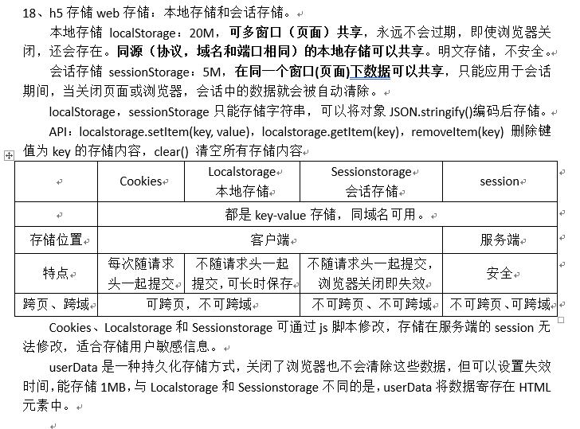

# 酷家乐——前端暑期实习一面

> 岗位：前端开发实习生-上海岗位
>
> 面试时间：2021-03-29 14 : 00
>
> 面试形式：电话面试
>
> 面试时长：约 30 分钟

一开始的邮件说是要使用腾讯会议，还特地下载了腾讯会议准备面试，结果是电话面。

面试时间约的两点整，面试官大概两点零六分打来电话，面试官大部分问的都还算比较基础。

## 面试复盘：

1. 页面加载时，**script 脚本的加载顺序**是怎么样的？回答了依次从上到下，问有无其他情况？

   **script标签中的defer和async属性区别**
   （1）defer属性规定是否延迟执行脚本，直到页面加载完为止。

   ​         async属性规定脚本一旦可用，就异步执行。
   （2）defer并行加载js文件，但会按照页面上script标签的执行顺序执行。

   ​         async并行加载js文件，加载完成就立即执行，不会按照页面上script标签的执行顺序执行。defer缩短了页面加载时间。

   **当浏览器碰到 script 脚本的时候：**
   （1）<script src="script.js"></script>
   **没有defer或async，浏览器会立即加载并执行指定的脚本，“立即”指的是在渲染该 script 标签之下的文档元素之前，也就是说不等待后续载入的文档元素，读到就加载并执行。**

   （2）<script async src="script.js"></script>
   有async，加载和渲染后续文档元素的过程将和script.js的加载与执行并行进行（异步）。

   （3）<script defer src="myscript.js"></script>
   有defer，加载后续文档元素的过程将和script.js的加载并行进行（异步），但是script.js 的执行要在所有元素html解析完成之后，DOMContentLoaded事件触发之前完成。

   

   然后从**实用角度**来说呢，首先把**所有脚本都丢到 </body> 之前**是最佳实践，因为对于旧浏览器来说这是唯一的优化选择，此法可保证非脚本的其他一切元素能够以最快的速度得到加载和解析。

   

   接着，我们来看一张图咯，此图告诉我们以下几个要点：
   （1）defer和async 在网络读取（下载、加载）这块儿是一样的，都是异步的（相较于 HTML 解析）。**它俩的差别在于脚本下载完之后何时执行，显然defer是最接近我们对于应用脚本加载和执行的要求的。**
   （2）defer是页面加载完再按顺序执行脚本，async 乱序执行，对它来说脚本的加载和执行是紧紧挨着的，所以不管你声明的顺序如何，只要它加载完了就会立刻执行。
   （3）仔细想想，async对于应用脚本的用处不大，因为它完全不考虑依赖（哪怕是最低级的顺序执行），不过它对于那些可以不依赖任何脚本或不被任何脚本依赖的脚本来说却是非常合适的，最典型的例子：Google Analytics

   

2. **盒模型**，区别？

   **什么是盒模型：**盒模型又称框模型（Box Model）,包含了元素内容（content）、内边距（padding）、边框（border）、外边距（margin）几个要素。

   

   **计算宽度和高度的不同。**

   **标准盒模型：**盒子总宽度/高度 = `width/height + padding + border + margin`。（ **即 width/height 只是内容高度，不包含 padding 和 border 值** ）

   **IE盒子模型：**盒子总宽度/高度 = `width/height + margin = (内容区宽度/高度 + padding + border) + margin`。（ **即 width/height 包含了 padding 和 border 值** ）

   

   通过css3新增的属性 `box-sizing: content-box | border-box`分别设置盒模型为标准模型（`content-box`）和IE模型（`border-box`）

3. **position** 属性值，分别代表什么意思？

   - `static`

     该关键字指定元素使用正常的布局行为，即元素在文档常规流中当前的布局位置。此时 `top`, `right`, `bottom`, `left` 和 `z-index `属性无效。

     静态定位是**每个元素获取的默认值**——它只是意味着“将元素放入它在文档布局流中的正常位置 ——这里没有什么特别的。

   - `relative`

     该关键字下，元素先放置在未添加定位时的位置，再在不改变页面布局的前提下调整元素位置（因此会在此元素未添加定位时所在位置留下空白）。position:relative 对 table-*-group, table-row, table-column, table-cell, table-caption 元素无效。

     **相对定位的元素是在文档中的正常位置偏移给定的值，但是不影响其他元素的偏移。**

   - `absolute`

     元素会被移出正常文档流，并不为元素预留空间，通过指定元素相对于最近的非 static 定位祖先元素的偏移，来确定元素位置。绝对定位的元素可以设置外边距（margins），且不会与其他边距合并。

     相对定位的元素并未脱离文档流，而绝对定位的元素则脱离了文档流。在布置文档流中其它元素时，绝对定位元素不占据空间。绝对定位元素**相对于*最近的非 `static` 祖先元素*定位**。

     当这样的祖先元素不存在时，则相对于ICB（inital container block, 初始包含块）。

   - `fixed`

     元素会被移出正常文档流，并不为元素预留空间，而是通过指定元素相对于屏幕视口（viewport）的位置来指定元素位置。元素的位置在屏幕滚动时不会改变。打印时，元素会出现在的每页的固定位置。`fixed` 属性会创建新的层叠上下文。当元素祖先的 `transform`, `perspective` 或 `filter` 属性非 `none` 时，容器由视口改为该祖先。

     **固定定位与绝对定位相似，但元素的包含块为 viewport 视口。该定位方式常用于创建在滚动屏幕时仍固定在相同位置的元素。**

   - `sticky`

     元素根据正常文档流进行定位，然后相对它的*最近滚动祖先（nearest scrolling ancestor）*和 [containing block](https://developer.mozilla.org/en-US/docs/Web/CSS/Containing_block) (最近块级祖先 nearest block-level ancestor)，包括table-related元素，基于`top`, `right`, `bottom`, 和 `left`的值进行偏移。偏移值不会影响任何其他元素的位置。

     **粘性定位**可以被认为是相对定位和固定定位的混合。元素在跨越特定阈值前为相对定位，之后为固定定位。

     须指定 [`top`](https://developer.mozilla.org/zh-CN/docs/Web/CSS/top), [`right`](https://developer.mozilla.org/zh-CN/docs/Web/CSS/right), [`bottom`](https://developer.mozilla.org/zh-CN/docs/Web/CSS/bottom) 或 [`left`](https://developer.mozilla.org/zh-CN/docs/Web/CSS/left) 四个阈值其中之一，才可使粘性定位生效。否则其行为与相对定位相同。

     

   **position定位和float的基准问题**

   （1）当父元素设置为**absolute、relative** 定位时，子元素相对于父元素定位基准是父元素的内容区，也即是content+padding区域，不包括border和margin。例：top设置的元素上外边距到参照物的上内边框的距离。

   （2）当父元素没有设置定位的时候，子元素相对于body进行定位。 

   （3）元素相对定位是以元素自己的左上角为基点进行移动，基准包括子元素的整体 = margin + border + padding + content ，即以margin外边界为基准进行定位。

   （4）float不能跨越父元素的padding。

   **fixed**：固定定位，相对于浏览器窗口进行定位。

   **sticky**：生成黏性定位的元素。类似relative和fixed结合体，如果目标区域在屏幕中可见，表现为relative；如果目标区域在屏幕中不可见，表现为fixed。

   

4. **两栏布局**，左侧固定，右侧自适应

   双栏布局（左边固定，右边自适应）。

   法一：将左侧固定的div盒子浮动，右侧自适应div盒子设置margin-left。

   法二：将左侧固定的div盒子采用绝对定位，右侧自适应div盒子设置margin-left。

   法三：table布局，父display:table；左display：table-cell；width：200px；右display：table-cell。

   法四：左右盒子双浮动，左width: 200px;右width: calc(100% - 200px);

   法五：flex，父display: flex;左flex: 0 0 200px;右flex: 1;

   法六：float+BFC，左盒子宽度固定，左浮动；右盒子宽度不固定，设置overflow:hidden。

   ```html
   <div style = “float: left; width:100px;height:100px”></div>
   <div style = “overflow:hidden; height:100px”></div>
   ```

   注：overflow: visble | hidden | scroll | auto

   

   ##### (1)利用float+margin实现 

   html代码:

   ```
   <body>
   <div id="left">左列定宽</div>
   <div id="right">右列自适应</div>
   </body>
   复制代码
   ```

   css代码:

   ```
   #left {
       background-color: #f00;
       float: left;
       width: 100px;
       height: 500px;
   }
   #right {
       background-color: #0f0;
       height: 500px;
       margin-left: 100px; /*大于等于#left的宽度*/
   }
   复制代码
   ```

   #####  (2)利用float+margin(fix)实现 

   html代码:

   ```
   <body>
   <div id="left">左列定宽</div>
   <div id="right-fix">
       <div id="right">右列自适应</div>
   </div>
   </body>
   复制代码
   ```

   css代码:

   ```
   #left {
       background-color: #f00;
       float: left;
       width: 100px;
       height: 500px;
   }
   #right-fix {
       float: right;
       width: 100%;
       margin-left: -100px; /*正值大于或等于#left的宽度,才能显示在同一行*/
   }
   #right{
       margin-left: 100px; /*大于或等于#left的宽度*/
       background-color: #0f0;
       height: 500px;
   }
   复制代码
   ```

   #####  (3)使用float+overflow实现 

   html代码:

   ```
   <body>
   <div id="left">左列定宽</div>
   <div id="right">右列自适应</div>
   </body>
   复制代码
   ```

   css代码:

   ```
   #left {
       background-color: #f00;
       float: left;
       width: 100px;
       height: 500px;
   }
   #right {
       background-color: #0f0;
       height: 500px;
       overflow: hidden; /*触发bfc达到自适应*/
   }
   复制代码
   ```

   优缺点：

   - 优点：代码简单，容易理解，无需关注定宽的宽度，利用bfc达到自适应效果
   - 缺点：浮动脱离文档流，需要手动清除浮动，否则会产生高度塌陷；不支持ie6

   #####  (4)使用table实现 

   html代码:

   ```
   <div id="parent">
       <div id="left">左列定宽</div>
       <div id="right">右列自适应</div>
   </div>
   复制代码
   ```

   css代码:

   ```
   #parent{
       width: 100%;
       display: table;
       height: 500px;
   }
   #left {
       width: 100px;
       background-color: #f00;
   }
   #right {
       background-color: #0f0;
   }
   #left,#right{
       display: table-cell;  /*利用单元格自动分配宽度*/
   }
   复制代码
   ```

   优缺点：

   - 优点：代码简单，容易理解，无需关注定宽的宽度，利用单元格自动分配达到自适应效果
   - 缺点：margin失效；设置间隔比较麻烦；不支持ie8-

   #####  (5)使用绝对定位实现 

   html代码:

   ```
   <body>
   <div id="parent">
       <div id="left">左列定宽</div>
       <div id="right">右列自适应</div>
   </div>
   </body>
   复制代码
   ```

   css代码:

   ```
   #parent{
       position: relative;  /*子绝父相*/
   }
   #left {
       position: absolute;
       top: 0;
       left: 0;
       background-color: #f00;
       width: 100px;
       height: 500px;
   }
   #right {
       position: absolute;
       top: 0;
       left: 100px;  /*值大于等于#left的宽度*/
       right: 0;
       background-color: #0f0;
       height: 500px;
   }
   复制代码
   ```

   #####  (6)使用flex实现 

   html代码:

   ```
   <body>
   <div id="parent">
       <div id="left">左列定宽</div>
       <div id="right">右列自适应</div>
   </div>
   </body>
   
   
   复制代码
   ```

   css代码:

   ```
   #parent{
       width: 100%;
       height: 500px;
       display: flex;
   }
   #left {
       width: 100px;
       background-color: #f00;
   }
   #right {
       flex: 1; /*均分了父元素剩余空间*/
       background-color: #0f0;
   }
   
   复制代码
   ```

   #####  (7)使用Grid实现 

   html代码:

   ```
   <body>
   <div id="parent">
       <div id="left">左列定宽</div>
       <div id="right">右列自适应</div>
   </div>
   </body>
   
   复制代码
   ```

   css代码:

   ```
   #parent {
       width: 100%;
       height: 500px;
       display: grid;
       grid-template-columns: 100px auto;  /*设定2列就ok了,auto换成1fr也行*/
   }
   #left {
       background-color: #f00;
   }
   #right {
       background-color: #0f0;
   }
   ```

   >
   > 作者：Sweet_KK
   > 链接：https://juejin.cn/post/6844903574929932301
   > 来源：掘金
   > 著作权归作者所有。商业转载请联系作者获得授权，非商业转载请注明出处。

   

5. **BFC**

   **BFC(Block Formatting Context)**：块级格式化上下文。
   BFC决定了元素如何对其内容进行定位，以及与其他元素的关系和相互作用。当设计到可视化布局的时候，BFC提供了一个环境，HTML元素在这个环境中按照一定的规则进行布局。一个环境中的元素不会影响到其他环境中的布局。

   **BFC的原理（渲染规则）**

   1. BFC元素垂直方向的边距会发生重叠。属于不同BFC外边距不会发生重叠
   2. BFC的区域不会与浮动元素的布局重叠。
   3. BFC元素是一个独立的容器，外面的元素不会影响里面的元素。里面的元素也不会影响外面的元素。
   4. 计算BFC高度的时候，浮动元素也会参与计算(清除浮动)

   **如何创建BFC**

   1. overflow不为visible;
   2. float的值不为none；
   3. position的值不为static或relative；
   4. display属性为inline-blocks,table,table-cell,table-caption,flex,inline-flex;

   

6. **清除浮动**方法

   **方法一：使用带clear属性的空元素**

   在浮动元素后使用一个空元素如`<div class="clear"></div>`，并在CSS中赋予`.clear{clear:both;}`属性即可清理浮动。亦可使用`<br class="clear" />或<hr class="clear" />`来进行清理。

   ```
   .news {
     background-color: gray;
     border: solid 1px black;
     }
   
   .news img {
     float: left;
     }
   
   .news p {
     float: right;
     }
   
   .clear {
     clear: both;
     }
   
   <div class="news">
   
   <p>some text</p>
   <div class="clear"></div>
   </div>
   ```

   **优点：简单，代码少，浏览器兼容性好。**
   **缺点：需要添加大量无语义的html元素，代码不够优雅，后期不容易维护。**

   **方法二：使用CSS的overflow属性**

   给浮动元素的容器添加`overflow:hidden;`或`overflow:auto;`可以清除浮动，另外在 IE6 中还需要触发 hasLayout ，例如为父元素设置容器宽高或设置 zoom:1。在添加overflow属性后，浮动元素又回到了容器层，把容器高度撑起，达到了清理浮动的效果。

   ```
   .news {
     background-color: gray;
     border: solid 1px black;
     overflow: hidden;
     *zoom: 1;
     }
   
   .news img {
     float: left;
     }
   
   .news p {
     float: right;
     }
   
   <div class="news">
   
   <p>some text</p>
   </div>
   ```

   **方法三：给浮动的元素的容器添加浮动**

   给浮动元素的容器也添加上浮动属性即可清除内部浮动，但是这样会使其整体浮动，影响布局，不推荐使用。

   **方法四：使用邻接元素处理**

   什么都不做，给浮动元素后面的元素添加clear属性。

   ```
   .news {
     background-color: gray;
     border: solid 1px black;
     }
   
   .news img {
     float: left;
     }
   
   .news p {
     float: right;
     }
   
   .content{
     clear:both;
     }
   
   <div class="news">
   
   <p>some text</p>
   <div class="content">***</div>
   </div>
   ```

   注意这里的div.content有内容。

   **方法五：使用CSS的:after伪元素**

   结合 :after 伪元素（注意这不是伪类，而是伪元素，代表一个元素之后最近的元素）和 IEhack ，可以完美兼容当前主流的各大浏览器，这里的 IEhack 指的是触发 hasLayout。
   给浮动元素的容器添加一个clearfix的class，然后给这个class添加一个:after伪元素实现元素末尾添加一个看不见的块元素（Block element）清理浮动。

   ```
   .news {
     background-color: gray;
     border: solid 1px black;
     }
   
   .news img {
     float: left;
     }
   
   .news p {
     float: right;
     }
   
   .clearfix:after{
     content: "020"; 
     display: block; 
     height: 0; 
     clear: both; 
     visibility: hidden;  
     }
   
   .clearfix {
     /* 触发 hasLayout */ 
     zoom: 1; 
     }
   
   <div class="news clearfix">
   
   <p>some text</p>
   </div>
   ```

   通过CSS伪元素在容器的内部元素最后添加了一个看不见的空格"020"或点"."，并且赋予clear属性来清除浮动。需要注意的是为了IE6和IE7浏览器，要给clearfix这个class添加一条zoom:1;触发haslayout。

   

   我们不难发现清除浮动的方法可以分成**两类**：

   一是利用 **clear 属性**，包括在浮动元素末尾添加一个带有 clear: both 属性的空 div 来闭合元素，其实利用 :after 伪元素的方法也是在元素末尾添加一个内容为一个点并带有 clear: both 属性的元素实现的。

   二是**触发浮动元素父元素的 BFC** (Block Formatting Contexts, 块级格式化上下文)，使到该父元素可以包含浮动元素，关于这一点。

   在网页主要布局时使用:after伪元素方法并作为主要清理浮动方式；在小模块如ul里使用overflow:hidden;（留意可能产生的隐藏溢出元素问题）；如果本身就是浮动元素则可自动清除内部浮动，无需格外处理；正文中使用邻接元素清理之前的浮动。

   最后可以使用相对完美的:after伪元素方法清理浮动，文档结构更加清晰。

   

7. **语义化标签**是什么意思？

   > 说得不错的博客：
   >
   > https://blog.csdn.net/macanfa/article/details/52128011
   >

   - 去掉或者丢失样式的时候能够让页面呈现出清晰的结构
   - 用户体验：例如title、alt用于解释名词或解释图片信息、label标签的活用；
   - 有利于SEO：和搜索引擎建立良好沟通，有助于爬虫抓取更多的有效信息：爬虫依赖于标签来确定上下文和各个关键字的权重；
   - 方便其他设备解析（如屏幕阅读器、盲人阅读器、移动设备）以意义的方式来渲染网页；
   - 便于团队开发和维护，语义化更具可读性，是下一步吧网页的重要动向，遵循W3C标准的团队都遵循这个标准，可以减少差异化。

   


   每个HTML标签都有**自己特定含义**（语义），语义化是指**使用语义恰当的标签**，使页面有**良好的结构**，页面**元素有含义**，能够**让人和搜索引擎都容易理解**。

   

   “语义化”指的是机器在需要更少的人类干预的情况下能够研究和收集信息，让网页能够被机器理解，最终让人类受益。
   　　**HTML 标签语义化**是让大家直观的**认识标签(markup)和属性(attribute)的用途和作用**，很明显Hx系列看起来很像标题，因为拥有粗体和较大的字号。<strong>,<em>用来区别于其他文字，起到了强调的作用。
   　　语义化的网页的好处，**最主要的就是对搜索引擎友好**，有了良好的结构和语义你的网页内容自然容易被搜索引擎抓取，你网站的推广便可以省下不少的功夫。
   　　语义 Web 技术有助于利用基于开放标准的技术，从数据、文档内容或应用代码中分离出意义。

   

   1. 有利于在没有css等修饰时，裸看代码能清除网页的结构以及布局
   2. 有利于搜索引擎优化，有助于爬虫抓取更多的有效信息：爬虫依赖于标签来确定上下文和各个关键字的权重。
   3. 有利于开发团队的后期优化开发以及维护。

   

   对html5的理解
   （1）DOCTYPE声明

   （2）**新增语义化标签：article定义文章、footer定义页脚、header定义页眉、nav定义导航、section文档中的区段、aside定义侧栏。**

   （3）input新增 type属性：email（输入为邮件格式）、tel（电话格式）、url（url格式）、search（搜索框）、range（自由拖动滑块）。

   （4）canvas：canvas元素使用JS在HTML网页上绘制图像。画布是一个矩形区域，可以控制其每一像素。canvas是基于位图的图形；SVG是基于矢量的图形，使用 XML 描述 2D 图形的语言。。

   （5）新增多媒体标签：video，audio。

   （6）新的HTML5的API：HTML Geolocation 地理位置、HTML Drag & Drop拖放。通过window.onLine来检测，用户当前的网络状况，返回一个布尔值。window.online用户网络连接时被调用，window.offline用户网络断开时被调用。  

   （7）**Web 存储：本地存储(localStroage)：长期存储数据，浏览器关闭后数据不丢失。会话存储(sessionStroage)：数据在浏览器关闭后自动删除。**

   （8）应用程序缓存（Application Cache）：web 应用可进行离线缓存，并可在没网时访问。
   application ----> application cache--->cache.manifest

   （9）web worker：JavaScript单线程执行，也就是同一时间只能做一件事，采用同步执行的方式，如果出现阻塞，后面的代码将不会执行。因此HTML5则提出了web Worker，表示JavaScript允许有多个线程，但是子线程完全受主线程的控制，子线程不能操作DOM，只有主线程可以操作DOM，所以以主线程为主的单线程执行原理成了JavaScript这门语言的核心。简单来说，其实就是在Javascript单线程执行的基础上，开启一个子线程，进行程序处理，而不影响主线程的执行，当子线程执行完毕之后再回到主线程上，在这个过程中并不影响主线程的执行过程。web worker实现单页面多线程，sharedworker实现多页面多线程，从而实现多标签通信。并行下载js代码，但是js下载仍然会阻塞其他资源的下载。

   （10）websocket全双工通信，持久连接。

   （11）**加入了requestAnimationFrame以及requestIdleCallback解决了定时器实现动画的问题。**

   

8. script 脚本一般放在什么位置，为什么？

   看第一题解答。

   

9. JS **基本数据类型**

   JS九种数据类型及区别

   （1）基本数据类型(值类型)：**Number,String,Boolean,Undefined,symbol,Null**。

   ​		  复杂（引用）数据类型**Object,Array,Function**。（null是特殊的引用类型，指针指向空地址）

   注：声明的变量还未初始化时，默认为undefined。调用函数时，如果没提供应提供的参数，该参数就等于undefined。当函数没有返回值时，默认返回undefined。未定义的变量是在程序中声明但未给出任何值得变量。如果尝试读取未定义变量的值，则返回为定义的值。

   （2）区别：Undefined、Null、Boolean、Number和 String，这5种基本数据类型可以直接访问，存放在**栈(stack)**中。引用数据类型在栈内存中保存在**堆内存**中的引用地址，通过这个引用地址可以快速查找到保存到堆内存中的对象。

   

   **symbol**是基本数据类型（es6的新数据类型），定义对象的唯**一属性名**。Symbol()函数会返回symbol类型的值，该类型具有静态属性和静态方法。但作为构造函数来说它并不完整，因为**不支持语法："new Symbol()"**。

   Symbol值作为属性名时，该属性是公有属性，可以在类的外部访问。但是**不会出现在for...in、for...of**的循环中，也不会被Object.keys()、 Object.getOwnPropertyNames()返回。

   如果要读取到一个对象的Symbol属性，可以通过 **Object.getOwnPropertySymbols()和Reflect.ownKeys()**取到。

   

10. **类型判断**，怎么判断是否为数组？

    1、**instanceof**方法
    instanceof 运算符是用来测试一个对象是否在其原型链原型构造函数的属性

    ```javascript
    var arr = []; 
    arr instanceof Array; // true
    ```

    2、constructor方法
    constructor属性返回对创建此对象的数组函数的引用，就是返回对象相对应的构造函数

    ```javascript
    var arr = []; 
    arr.constructor == Array; //true
    ```

    3、最简单的方法，这种写法兼容性最好使用**Object.prototype.toString.call()**

    ```javascript
    function isObjArr(value){
         if (Object.prototype.toString.call(value) === "[object Array]") {
                console.log('value是数组');
           }else if(Object.prototype.toString.call(value)==='[object Object]'){//这个方法兼容性好一点
                console.log('value是对象');
          }else{
              console.log('value不是数组也不是对象')
          }
    }
    ```

    4、ES5新增方法**isArray()**

    ```javascript
    var a = new Array(123);
    var b = new Date();
    console.log(Array.isArray(a)); //true
    console.log(Array.isArray(b)); //false
    ```

    ps：**千万不能使用typeof来判断对象和数组，因为这两种类型都会返回"object"。**

    

11. **原型链**，每个对象都有原型链吗，原型链是怎么形成的？**原型链末端**？

    JavaScript原型，原型链?

    **原型作用**：**共享属性和方法**

    当需要一个属性时，Javascript引擎会先看当前对象中是否有这个属性，如果没有，就会查找_proto_所指向构造函数中prototype原型对象是否有这个属性，如此递推下去，一直检索到Object对象，就形成了**原型链**的概念。

    xialuo._proto_--->Student.prototype,Student.prototype._proto_--->People.prototype,People.prototype._proto--->Object.prototype,Object.prototype._proto_--->null。

    注：**原型链最终的指向是Object的prototype, 而Object中的proto是null**。

    

    **prototype（函数的原型对象）**：函数才有prototype对象。

    __proto__(**对象的原型**)：对象才有__proto__（这里的对象除了狭义的对象，也包括函数、数组等对象）

    **原型链：**对象的__proto__指向构造函数的prototype，构造函数的prototype本身也是个对象，是对象肯定也有__proto__，那他的__proto__指向了谁呢，顺着这个问题，我们延着一个对象__proto__向上查找，这条线路就是我们所说的原型链。

    注：

    （1）通过构造函数，new出的对象，新对象的__proto__指向构造函数的prototype；

    （2）所有普通函数的__proto__指向Function()的prototype；

    （3）非构造函数new出的对象（{} new Object() 对象的prototype）的__proto__指向Object的prototype。

    （4）Object的prototype的__proto__指向null。

    

12. **new** 操作，为什么实例能继承属性？子类访问到构造函数属性值，改变属性值原型会变吗？

    (1)在内存中开辟一块空间，存储新创建的对象。

    (2)将构造函数的作用域赋给新对象，即把this指向新对象。同时将新对象的__proto__属性指向构造函数的**ptototype属性**。

    (3)将属性和方法加入到this引用的对象中。

    (4)新创建的对象由this所引用，并且最后隐式的返回this。

    **注：**构造函数返回this对象，没有影响；构造函数返回值类型，没有影响；构造函数返回的是其他对象，则实例化对象被替换成该对象。

    

13. function Ａ 里面声明 function Ｂ，function Ｂ 里面能访问到 Ａ 里面定义的变量吗？为什么？

    **闭包：指有权访问另一个函数作用域中的变量的函数**(JavaScript高级程序设计)

    闭包是一种特性，函数每执行一次，都会生成一个闭包，这个闭包能不能持久存在，要看里面的变量能不能被外部所持有，外部依不依赖这个变量。

    **特性**：

    a、函数嵌套函数。

    b、参数和变量不会在函数调用后被垃圾回收机制回收。

    c、在函数内部可以引用函数外部的变量。

    **优点：**

    a、可以设计私有的方法和变量。

    b、保护函数内的变量安全，避免全局变量的污染。

    c、在内存中维持一个变量，作为缓存。

    **缺点：**

    a、被引用的函数内的私有变量不能被销毁，增大了内存消耗，造成内存泄漏，解决方法是可以在使用完变量后手动为它赋值为null；

    **应用：**（1）隐藏数据。（2）做一个简单的cache工具。

    

    **闭包两种主要形式：**

    （1）函数作为返回值，返回之后再执行：实现了在全局变量下获取到局部变量中的变量的值。

    （2）函数作为参数传递。

    

14. ES6 **let const var** 之间的区别？

    **let：**

    （1）必须先定义后使用，同一个作用域下不能重复定义同一个名称，但是可以修改值。

    （2）不存在变量提升（暂时性死区）。

    （3）块级作用域。

    **var：**

    （1）**声明变量的作用域限制在其声明位置的上下文中，而非声明变量总是全局的**。

    （2）**预解析的存在，将声明的变量或函数提到代码开头**。

    **const：**只有es6可以定义静态变量。

    （1）声明一个只读常量，一旦声明，常量的值就不能改变了（不针对引用类型）。但是如果是复合类型时，如果只改变复合类型的其中某个Value项时，将还是正常使用。例如 const a = 3 ; a = 5时将会报错。 const obj = {}；obj.name = ‘amy’ 不报错。

    （2）不存在变量提升（暂时性死区）。

    （3）块级作用域。

    

15. **map** 与 Object 之间的区别？

    在将Map引入JavaScript语言之前，Object是创建键/值对数据结构的主要方式。

    主要有两点不同：

    1. **key的类型无限制**：Object无法使用非字符串值作为键名，但Map的键名可以是任意类型

       ​									**对象**的key是**字符串或者是Symbol**，map的key可以是任何类型

    2.  **可直接遍历**：

       常规对象里，为了遍历keys、values和entries，你必须将它们转换为数组，如使用Object.keys()、Object.values()和Object.entries()，或使用for ... in，另外for ... in循环还有一些限制：它仅仅遍历可枚举属性、非Symbol属性，并且遍历的顺序是任意的。

       但Map可直接遍历，且因为它是键值对集合，所以可直接使用for…of或forEach来遍历。这点不同的优点是为你的程序带来更高的执行效率。

    

16. **浏览器存储**，区别？

    

    **浏览器缓存：**

    它分为**强缓存**和**协商缓存**：
    1）浏览器在加载资源时，先根据这个资源的一些http header判断它是否命中强缓存，强缓存如果命中，浏览器直接从自己的缓存中读取资源，不会发请求到服务器。比如某个css文件，如果浏览器在加载它所在的网页时，这个css文件的缓存配置命中了强缓存，浏览器就直接从缓存中加载这个css，连请求都不会发送到网页所在服务器；

    2）当强缓存没有命中的时候，浏览器一定会发送一个请求到服务器，通过服务器端依据资源的另外一些http header验证这个资源是否命中协商缓存，如果协商缓存命中，服务器会将这个请求返回，但是不会返回这个资源的数据，而是告诉客户端可以直接从缓存中加载这个资源，于是浏览器就又会从自己的缓存中去加载这个资源；

    3）强缓存与协商缓存的共同点是：如果命中，都是从客户端缓存中加载资源，而不是从服务器加载资源数据；区别是：强缓存不发请求到服务器，协商缓存会发请求到服务器。

    4）当协商缓存也没有命中的时候，浏览器直接从服务器加载资源数据。

    

17. 平时数据结构用得多吗？**判断链表是否存在环？**

    **双指针**做，涉及到链表的题目，大部分能够使用双指针解决。

    还可以使用哈希表，或者标记法。

    

18. **Vue，JQuery 与原生 JS** 区别？对比、优缺点？

    现代前端框架技术的发展正是抽象和分层思想的实践。将前端问题分为数据状态管理和与数据状态保持同步的页面渲染能力封装。关注分离、松散耦合便可以分别针对性的优化，改善开发体验。**封装好解决方案后，前端开发者就可以忽略其底层实现细节，把精力放在业务逻辑上**

    

    **JQuery：**

    Jquery只是对原生JS的API选择器等等进行了封装，便于操作DOM，**本质还是操作DOM实现逻辑**，数据和界面还是连接在一起的。
    适用于需要操作DOM的业务：**动画，交互效果，页面特效**。

    **Vue.js：**

    MVVM模型，将数据层和视图层完全分离开，不仅对API进行封装， 还提供了一系列的解决方案。这是一个思想的转变。数据驱动的机制，**主要操作的是数据而不是频繁操作DOM(导致页面频繁重绘)**。
    适用的业务：数据相关的处理以及操作。

    

    vue适用的场景：复杂数据操作的后台页面，表单填写页面

    jquery适用的场景：比如说一些html5的动画页面，一些需要js来操作页面样式的页面

    

    vue优点？ 数据驱动，组件系统

    **轻量级框架**：只关注视图层，是一个构建数据的视图集合。

    **双向数据绑定**：保留了angular的特点，在数据操作方面更为简单。

    **组件化**：保留了react的优点，实现了html的封装和重用，在构建单页面应用方面有着独特的优势。

    **视图，数据分离**：数据的更改不需要修改代码逻辑，只需操作数据。

    **虚拟****DOM**：dom操作是非常费性能，不再使用原生dom操作节点，极大解放dom操作，但具体操作还是dom不过是换了另一种方式。

    **运行速度更快**：相比较与react而言，操作虚拟dom，vue性能更好。

    Vue是通过Vue的vm实例对象将数据Model和View完全分离开来了。对数据进行操作不再需要操作相应的DOM对象，通过Vue的vm实例对象实现相互的绑定。这就是传说中的MVVM。

    

    可以简单的理解成是：使用广泛的前端开发套件，可以帮助你快速的网站。
    前段框架的好处：对于互联网的产品而言，前端用户体验往往决定了一款产品的竞争力和吸引力;而对于前端工程师来说，考虑的问题更为复杂，他们既要为网站上提供的产品和服务实现一流的Web页面、优化代码，保证体验的最佳，更要考虑与市面上各大浏览器的兼容性，还需顾及Web前端表现层和前后端交互的架构，以及模块化、通用类库、框架编写等一系列问题，由此提升前端开发的效率，降低开发成本和周期。

    

19. 反问，面试官说可以介绍一下他没问到的自己的一些强项、特点……

    这个……暂时没有，继续努力吧。


JS 基础还差得远……继续努力！

